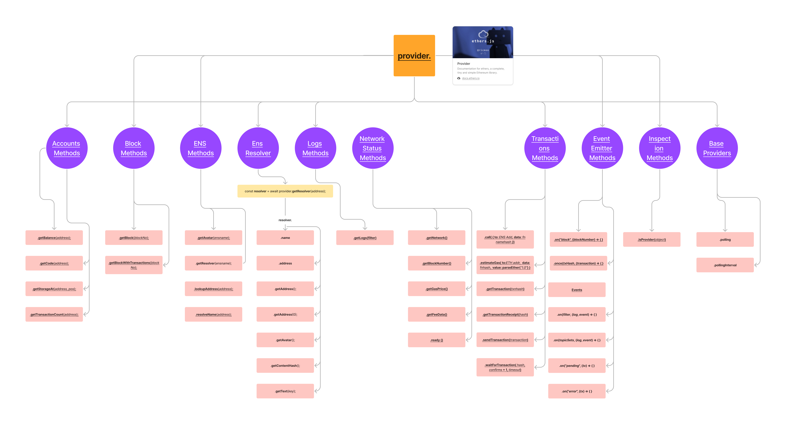
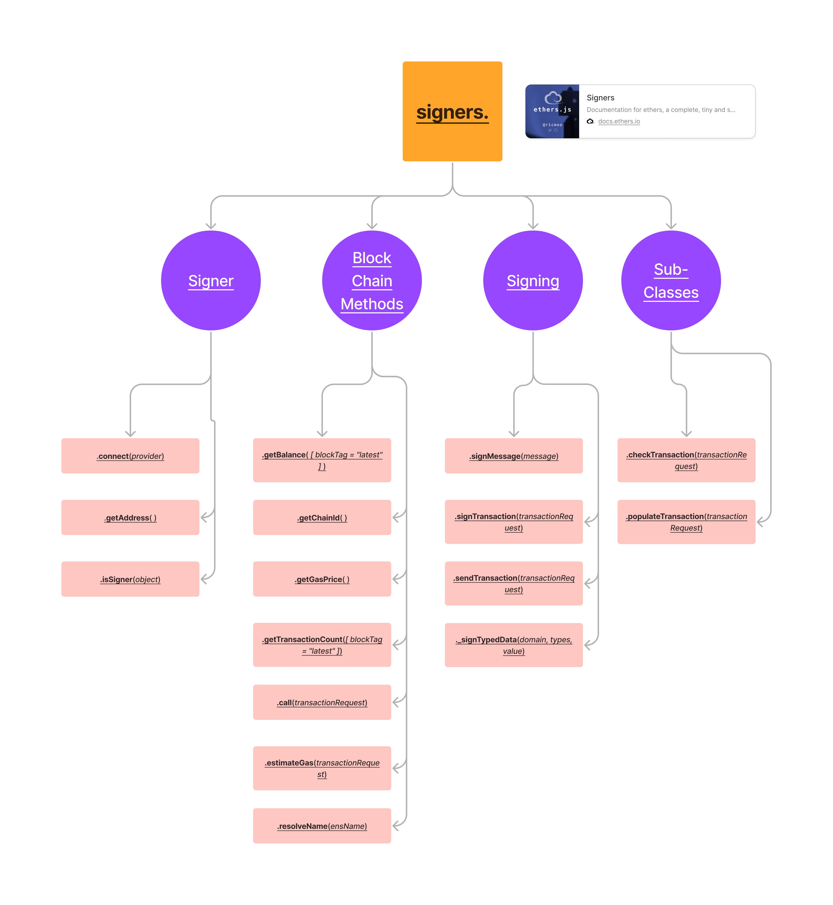

## Etheasy

## Description
An interactive documentation for Ethers.js

## For development 
1. Clone the repository and install all the dependencies   
    `yarn` or `yarn install`
2. Start the development server  
    `yarn start`
3. Visit [localhost:3000](http://localhost:3000)

## Contributing to this project
If you wish to contribute to this project,
Please check the [Contribution docs](./readme/Contribution.md) for more information

## Deployment
[Live preview](https://etheasy.web.app)
+ <code?>Alpha</code> Please try with a metamask/any web3 wallet installed browser to avoid blank screen

## Interactive documentation
Please click on the image to direct you to the documentation

 
